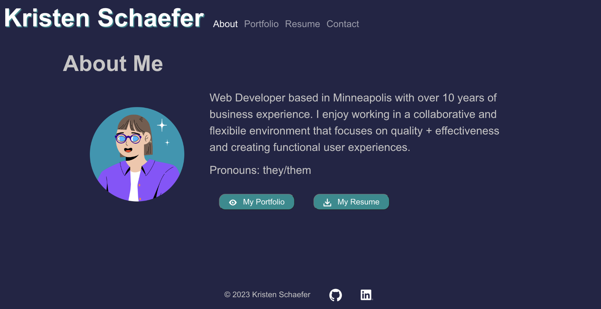

# Kristen Schaefer Professional Portfolio Using React

[Deployed Site](https://kcschaefs.github.io/react-professional-portfolio/)

## User Story
AS AN employer looking for candidates with experience building single-page applications
I WANT to view a potential employee's deployed React portfolio of work samples
SO THAT I can assess whether they're a good candidate for an open position

## Tasks
- Create a React app (client side only)
- Create and develop all of the compononents (header, nav, footer, items for each section)
- Create and develop all of the pagees (about, portfolio, resume, contact)
- Add the components to the pages
- Add the pages to the App.js
- Create routing between the pages
- Style + troubleshoot

## Learnings
- Creating a full client-side React app from scratch 
- React routing
- How to display and download a PDF on the webpage
- Form validation using both html and javascript (with a regex)
- Implementing Carousel from React Bootstrap and using an array.map to create all of the components dynamically

## Future Improvements
- Better styling
- Code cleanup
- Find and integrate third-party code to send an email from the contact page upon clicking the "submit" button
